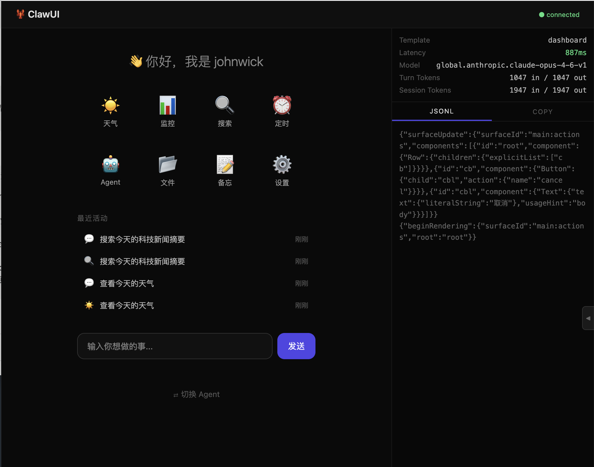
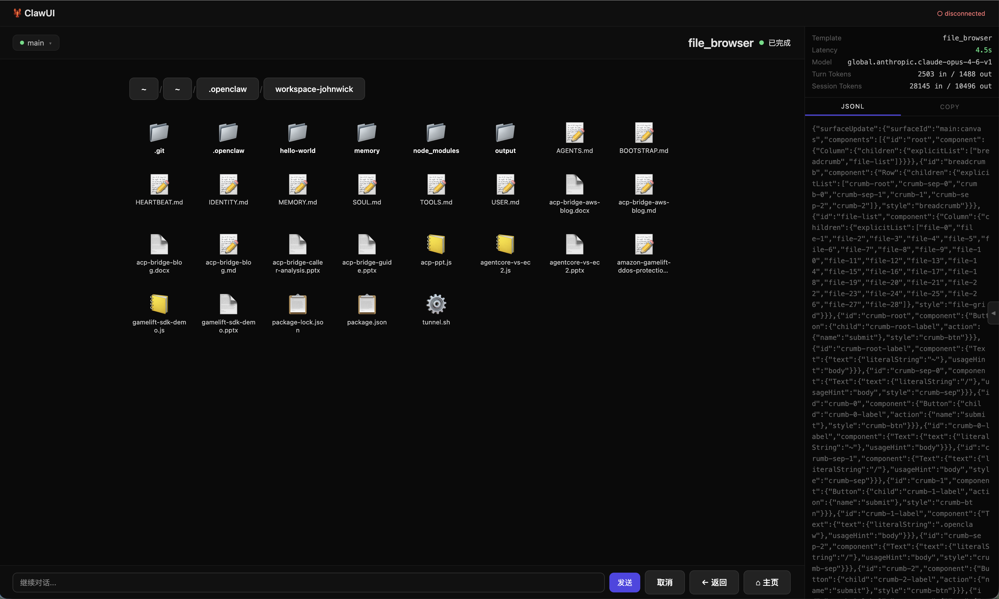

# 🦞 ClawUI

OpenClaw A2UI 插件 —— 让 AI Agent 用一行调用生成可交互界面。

## 它做什么

OpenClaw 已有底层 A2UI 管道（canvas `a2ui_push`），但 Agent 需要手写 JSONL。ClawUI 提供高层抽象：

```
之前: Agent 手写 A2UI JSONL → canvas a2ui_push → 渲染
之后: Agent 调用 a2ui_render({ template: "form", data: {...} }) → 自动生成 → 渲染
```

## 界面预览




<!-- ↑ Finder 风格网格布局：大图标 + 文件名，文件夹/文件分类显示，面包屑导航 -->

## 核心能力

- **模板驱动** — 预制模板库（表单、列表、确认框等），Agent 只需指定模板名 + 数据
- **Action 路由** — 用户在界面上的操作自动映射到 OpenClaw 工具（message/cron/web_search 等）
- **Markdown 降级** — 无 canvas 的客户端（Discord/飞书）自动回退为文字卡片
- **标准插件** — 遵循 OpenClaw 插件规范，in-process 运行

## 架构

```
Agent ──a2ui_render──► ClawUI Plugin ──JSONL──► canvas a2ui_push ──► A2UI Renderer
                           │                                              │
                           │ 降级                                    userAction
                           ▼                                              │
                     Markdown 文字卡片                                     ▼
                     (Discord/飞书)                              ClawUI Action Router
                                                                          │
                                                                ┌─────────┼─────────┐
                                                                ▼         ▼         ▼
                                                            message    cron    web_search
```

## 快速开始

```bash
# 1. 添加到 OpenClaw 配置
# ~/.openclaw/config.json
{
  "plugins": {
    "load": { "paths": ["/path/to/clawUI"] },
    "entries": { "clawui": { "enabled": true } }
  }
}

# 2. 重启 Gateway
openclaw gateway restart

# 3. Agent 即可使用
# Agent 调用: a2ui_render({ template: "confirmation", data: { title: "Deploy?", message: "确认部署 v1.2.3?" } })
```

## 文档

- [设计文档](docs/DESIGN.md) — 架构、模块、数据流
- [模板指南](docs/TEMPLATES.md) — 模板格式、可用组件、自定义模板
- [集成指南](docs/INTEGRATION.md) — 安装、配置、Agent 使用、故障排查

## 项目结构

```
clawUI/
├── openclaw.plugin.json          # 插件 manifest
├── index.ts                      # 插件入口
├── src/
│   ├── tool.ts                   # a2ui_render Agent Tool
│   ├── templates/
│   │   ├── engine.ts             # 模板引擎
│   │   ├── registry.ts           # 模板注册表
│   │   └── builtin/              # 内置模板
│   ├── actions/
│   │   ├── router.ts             # Action → 工具路由
│   │   └── builtins.ts           # 内置 action
│   ├── fallback/
│   │   └── markdown.ts           # Markdown 降级
│   └── utils/
│       ├── jsonl.ts              # JSONL 生成
│       └── data-binding.ts       # 模板变量替换
├── test/
├── docs/
│   ├── DESIGN.md
│   ├── TEMPLATES.md
│   └── INTEGRATION.md
└── README.md
```

## 版本计划

| 版本 | 内容 | 状态 |
|------|------|------|
| v0.1 | 插件骨架 + a2ui_render tool + 基础模板 | ✅ 完成 |
| v0.2 | Action router + 工具映射 | ✅ 已提前实现 |
| v0.3 | 完整模板库 + 自定义模板 | ✅ 完成 |
| v0.4 | Markdown 降级 | ✅ 基础降级已实现 |
| v0.5 | CLI 命令 + 模板预览 | ✅ 完成 |

## License

MIT-0
